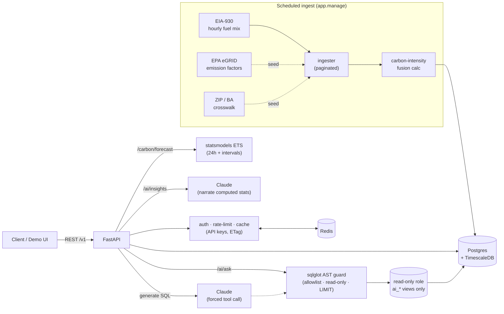

# GridClean

> Live carbon intensity of electricity, by location — a data-fusion API with a guardrailed AI layer.

GridClean computes **grams of CO₂ per kWh for the electricity grid serving a given ZIP code, right now**, and forecasts the cleanest hours ahead. It fuses two open datasets that can't answer the question alone:

- **EIA-930** — the live hourly fuel mix of each regional grid (coal vs. gas vs. wind vs. solar). No emissions data.
- **EPA eGRID** — CO₂ emission factors per fuel type (lb CO₂ / MWh). No live data.

Multiply the live fuel mix by the emission factors and you get a carbon-intensity number that **neither source publishes** — the metric companies like WattTime sell commercially. On top sits a deliberately small, well-engineered AI layer: guardrailed natural-language querying, a 24-hour forecast with prediction intervals, and LLM-narrated insights over computed statistics.

## See it

- **Interactive demo** → `/app/` — a "grid console" that exercises every endpoint live (location lookup, fuel mix, 48h→24h forecast chart, region comparison, and the AI features). Tailwind v4 + vanilla JS + Chart.js.
- **API reference** → `/scalar` (interactive Scalar) or `/docs` (Swagger).

```bash
curl "http://localhost:8000/v1/carbon/now?zip=90012"   # → LDWP, not CISO — the geography nuance, surfaced
```

## Architecture



The fusion's hard part — and its headline data-engineering story — is **reconciling geographies**: EIA reports by *balancing authority*, eGRID by *subregion*, and they don't align 1:1. GridClean stores the mapping with a `mapping_confidence` flag (`exact` / `dominant` / `approximate`) and surfaces it in every response rather than hiding the uncertainty. See [`docs/SPEC.md`](docs/SPEC.md) §4.3.

## Endpoints

| Endpoint | Description |
|---|---|
| `GET /v1/carbon/now?zip=\|region=` | Live intensity + fuel mix + honest caveats |
| `GET /v1/carbon/history?region=…&cursor=…` | Hourly series, **cursor (keyset) pagination** |
| `GET /v1/carbon/compare?regions=…` | N regions ranked cleanest → dirtiest |
| `GET /v1/carbon/forecast?region=…` | 24h forecast w/ prediction intervals + backtested MAE |
| `GET /v1/carbon/cleanest-hour?zip=\|region=` | Best upcoming hour to run a load |
| `GET /v1/carbon/savings?…` | CO₂ saved time-shifting a load between local hours |
| `GET /v1/regions[/{code}]`, `GET /v1/meta/freshness` | Reference data + data-staleness |
| `POST /v1/ai/ask` | Natural language → guardrailed SQL → results |
| `GET /v1/ai/insights?region=…` | Narrated statistical summary |

## AI layer

Not a ChatGPT wrapper — the engineering is in the guardrails and the evals.

**`/ai/ask` (text-to-SQL), defense in depth — never the prompt:**
1. Claude emits SQL through a **forced tool call** (structured, never prose); the schema + few-shot prompt is prompt-cached.
2. **sqlglot AST validation** — must be a single read-only `SELECT`, referencing only the curated `ai_*` views (allowlist), with an enforced `LIMIT`.
3. Executed as a dedicated **`gridclean_ro` Postgres role** that has `SELECT` on those views only — it *cannot* read base tables or write anything.
4. Per-connection `default_transaction_read_only` + `statement_timeout`, plus one repair retry on DB error. The exact SQL run is always returned for review.

**`/ai/insights`** uses **compute-then-narrate**: trends, min/max hours, and the renewable↔intensity correlation are computed in NumPy; the LLM only narrates those numbers, so it can't fabricate figures.

### Eval suite

`python -m app.eval.run` scores text-to-SQL by **execution match** (run the model's SQL and a reference query, compare result sets; containment-based, so a correct answer that returns extra columns still passes):

| Metric | Result |
|---|---|
| Questions | 12 (aggregates, filters, rankings, latest-per-region, fuel sums) |
| **Execution-match accuracy** | **12 / 12 (100%)** |

> Honest caveat: this is a curated set over clean, documented views — easier than BIRD-style benchmarks against raw schemas (~80% SOTA). Broader/ambiguous questions would lower it. The point is the harness: an eval you can run, not a vibe.

## Performance

Measured locally — single Uvicorn worker, Docker Postgres + Redis on the same machine, 2,000 requests at concurrency 50. Every request includes API-key auth (a DB lookup), Redis rate-limiting, and structured JSON access logging, so these are full-path numbers, not a bare handler.

| Endpoint | p50 | p95 | p99 | throughput |
|---|---|---|---|---|
| `/v1/carbon/now` (cached) | 51 ms | 102 ms | 231 ms | ~806 req/s |
| `/v1/regions` (DB read) | 46 ms | 127 ms | 187 ms | ~872 req/s |
| `/v1/carbon/history` (cursor, 100 rows) | 107 ms | 202 ms | 242 ms | ~419 req/s |

(Reproduce with the script in commit history / `docs`. Real deployment numbers would differ with multiple workers and managed Postgres.)

## Engineering highlights

- **Data engineering** — a real ETL fusion (live feed × static reference × geographic crosswalk), TimescaleDB hypertables, paginated backfill, and honest geography reconciliation via `mapping_confidence`.
- **API maturity** — cursor (keyset) pagination, Redis rate limiting with `X-RateLimit-*` headers, ETag / `Cache-Control` (→ 304), API-key auth (SHA-256, anonymous-by-IP fallback), structured JSON logging + request timing, Alembic migrations.
- **AI engineering** — guardrailed text-to-SQL with DB-level isolation, compute-then-narrate, and a runnable eval suite.
- **Testing** — 47 tests (unit + integration); AI tests inject a fake generator/narrator so CI makes no live model calls, while the real guard + read-only execution path run against synthetic data. CI: ruff + migrations + pytest against Timescale & Redis services.

## Stack

FastAPI · Postgres + TimescaleDB · Redis · statsmodels (ETS forecasting) · Anthropic Claude (`claude-opus-4-8`) · sqlglot · Tailwind v4 + Chart.js (demo UI) · Scalar (docs). Deploy target: Render/Railway + Neon.

## Quickstart (local dev)

```bash
# 1. Start Postgres (host port 5433) + Redis
make up                 # or: docker compose up -d db redis

# 2. Create a virtualenv and install
python3 -m venv .venv && source .venv/bin/activate
make install            # pip install -e ".[dev]"

# 3. Configure env  (needs a free EIA key: https://www.eia.gov/opendata/register.php;
#    ANTHROPIC_API_KEY for the AI layer)
cp .env.example .env

# 4. Migrate, seed, ingest
make migrate
python -m app.manage seed
python -m app.manage ingest --hours 504   # ~21 days (enough for the forecaster)

# 5. Run → http://localhost:8000/app/
make dev
```

`docs/API_PLAYGROUND.md` is a copy-paste tour of every endpoint.

### Auth & limits

Endpoints work anonymously, rate-limited per IP; an API key raises your limit. Every response carries `X-RateLimit-*` headers; read-heavy endpoints send `ETag` + `Cache-Control` (send `If-None-Match` for a 304).

```bash
python -m app.manage apikey "My App" --limit 240   # mint a key (shown once)
curl -H "X-API-Key: gck_..." "http://localhost:8000/v1/carbon/now?region=CISO"
```

> **Note:** docker-compose maps Postgres to host port **5433** (to avoid clashing with a local Postgres on 5432). The `api` container talks to `db:5432` internally, so set `DATABASE_URL=...@localhost:5433/...` only for host runs.

```bash
make test    # pytest (47 tests)
make lint    # ruff
```

## Honest limitations

- **Average, not marginal, emissions** — computed from the reported fuel mix, not which plant ramps for the next kWh.
- **Geography is approximate** — BA↔subregion mismatch, surfaced via `mapping_confidence`.
- **Hourly and lagged** — EIA-930 trails real time by a few hours; "right now" means the most recent available hour.
- **v1 uses national fuel-level emission factors** — subregion-specific eGRID rates are a planned refinement.

## Attribution

- Electricity generation: U.S. Energy Information Administration (EIA-930)
- Emission factors: U.S. EPA eGRID
- ZIP / region mapping: U.S. EPA Power Profiler / U.S. Census
